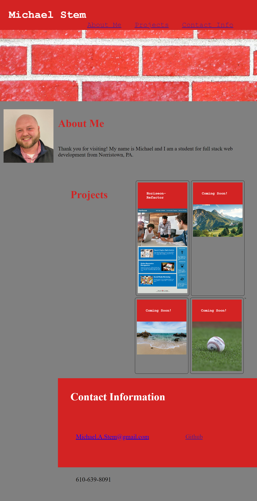

# Michael_Stem-Portfolio

## Description
Advanced CSS Challenge: Professional Profolio

For this Challenge I wrote HTML and CSS for a Professional Portfolio to use to showcase my work in the futute. Using the User Story and Acceptance Criteria I used what I've learned in the first 3 weeks to produce the portfolio. 



# User Story

```
AS AN employer
I WANT to view a potential employee's deployed portfolio of work samples
SO THAT I can review samples of their work and assess whether they're a good candidate for an open position
```

# Acceptance Criteria

```
GIVEN I need to sample a potential employee's previous work
WHEN I load their portfolio
THEN I am presented with the developer's name, a recent photo or avatar, and links to sections about them, their work, and how to contact them
WHEN I click one of the links in the navigation
THEN the UI scrolls to the corresponding section
WHEN I click on the link to the section about their work
THEN the UI scrolls to a section with titled images of the developer's applications
WHEN I am presented with the developer's first application
THEN that application's image should be larger in size than the others
WHEN I click on the images of the applications
THEN I am taken to that deployed application
WHEN I resize the page or view the site on various screens and devices
THEN I am presented with a responsive layout that adapts to my viewport
```

# Installation
A new repository was created and cloned onto my local computer. 

# Usage
Use the navigation bar at the top right of the page to jump to the different sections in the portfolio.

# Links
```
Visit the completed website at: https://mikestem.github.io/Michael_Stem-Portfolio/

Visit the Github repository at: https://github.com/mikestem/Michael_Stem-Portfolio
```